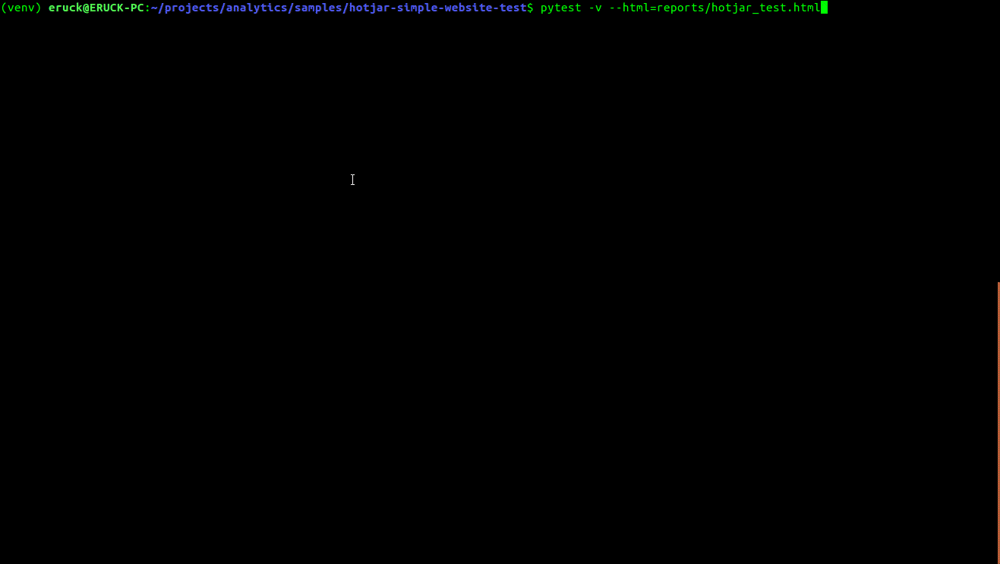

# Hotjar Simple Automated Website Test
This is a simple simulation to test the Signup and Login processes
on [Hotjar](https://hotjar.com) website, using python selenium and pytest
frameworks.

## Demo


## Platforms
* Linux

To run test on other platforms (Windows, Mac), download the corresponding driver from [Selenium](https://selenium.dev)

This demo currently uses the selenium chrome driver for Linux

## Key Modules
* Selenium (Python)
* Selenium Chrome driver
* Pytest

## Failed Test
A failed test will generate a screenshot of the failed stage on the browser and save
in the `screenshots` folder.

## Run Test

### Clone Repository
```
git clone https://gitlab.com/eruckemmanuel/hotjar-simple-website-test
```

### Install Python Dependencies
```
pip install -r requirements.txt
```

### Define Account Data
In the .env file, add details for Hotjar account


### Run Successful Login Test
```
pytest -m successful_login -v
```

### Run Failed Login Test
```
pytest -m failed_login -v
```

### Run Signup test
```
pytest -m sigup -v
```

### Run All tests
```
pytest -v
```

### Run Test & Generate HTML Report
```
pytest -m successful_login -v --html=reports/successful_login_test.html
```

```
pytest -m failed_login -v --html=reports/failed_login_test.html
```


```
pytest -m signup -v --html=reports/signup_test.html
```

```
pytest -v --html=reports/hotjar_test.html
```